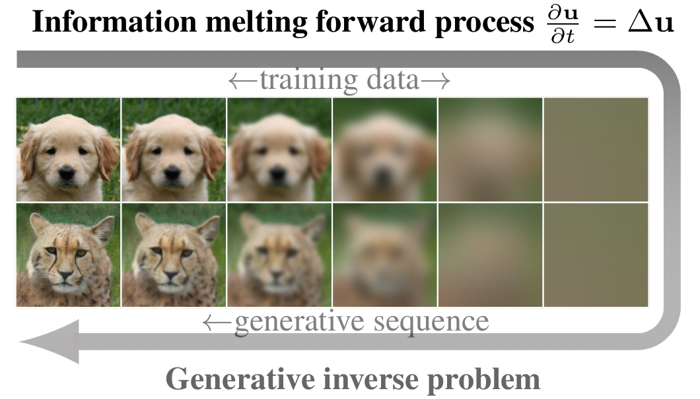

*This website contains sample trajectory visualizations for our ICLR 2023 paper "Generative Modeling With Inverse Heat Dissipation".*

While diffusion models have shown great success in image generation, their noise-inverting generative process does not explicitly consider the structure of images, such as their inherent multi-scale nature. Inspired by diffusion models and the empirical success of coarse-to-fine modelling, we propose a new diffusion-like model that generates images through stochastically reversing the heat equation, a PDE that locally erases fine-scale information when run over the 2D plane of the image. We interpret the solution of the forward heat equation with constant additive noise as a variational approximation in the diffusion latent variable model. Our new model shows emergent qualitative properties not seen in standard diffusion models, such as disentanglement of overall colour and shape in images. Spectral analysis on natural images highlights connections to diffusion models and reveals an implicit coarse-to-fine inductive bias in them.

*Example of the information destroying forward process (during training) and the generative inverse process (sampling), both defined by the PDE.*
  
## Video abstract

<iframe width="560" height="315" src="https://www.youtube.com/embed/qY1juqIDT10" frameborder="0" gesture="media" allow="encrypted-media" allowfullscreen></iframe> 
  
## Sample trajectories

We provide generation sequences for different data sets. Generation starts from a flat image and adds progressively more detail. The iterative generative process can be visualized as a video, showing the smooth change from effective low-resolution to high resolution. Effectively, the model redistributes the mass in the original image to form an image.

### MNIST

<video width="49%" controls>
  <source src="assets/video/mnist.mp4" type="video/mp4">
  Your browser does not support the video tag. Download the video <a href="assets/video/mnist.mp4">here</a>.
</video>

### CIFAR-10

<video width="49%" controls>
  <source src="assets/video/cifar10.mp4" type="video/mp4">
  Your browser does not support the video tag. Download the video <a href="assets/video/cifar10.mp4">here</a>.
</video>

  
### AFHQ 256×256

<video width="49%" controls>
  <source src="assets/video/afhq_1.mp4" type="video/mp4">
  Your browser does not support the video tag. Download the video <a href="assets/video/afhq_1.mp4">here</a>.
</video>
<video width="49%" controls>
  <source src="assets/video/afhq_2.mp4" type="video/mp4">
  Your browser does not support the video tag. Download the video <a href="assets/video/afhq_2.mp4">here</a>.
</video>

### FFHQ 256×256

<video width="49%" controls>
  <source src="assets/video/ffhq_1.mp4" type="video/mp4">
  Your browser does not support the video tag. Download the video <a href="assets/video/ffhq_1.mp4">here</a>.
</video>
<video width="49%" controls>
  <source src="assets/video/ffhq_2.mp4" type="video/mp4">
  Your browser does not support the video tag. Download the video <a href="assets/video/ffhq_2.mp4">here</a>.
</video>

### LSUN-Churches 128×128

<video width="49%" controls>
  <source src="assets/video/lsun_church_1.mp4" type="video/mp4">
  Your browser does not support the video tag. Download the video <a href="assets/video/lsun_church_1.mp4">here</a>.
</video>
<video width="49%" controls>
  <source src="assets/video/lsun_church_2.mp4" type="video/mp4">
  Your browser does not support the video tag. Download the video <a href="assets/video/lsun_church_2.mp4">here</a>.
</video>

### Interpolations

Qualitatively, interpolations in the full latent space of the model are smoother than the corresponding interpolations in a standard diffusion model. This is also the case when comparing interpolations using DDIM, a deterministic sampler. 

<video width="70%" controls align="center">
  <source src="assets/video/interpolations.mp4" type="video/mp4">
  Your browser does not support the video tag. Download the video <a href="assets/video/interpolations.mp4">here</a>.
</video>

### Sampling with a shared initial state

One way to visualize the stochasticity of the generative process is to keep the initial draw from the prior fixed and sample multiple trajectories based on it. Large-scale features are decided in the beginning of the process and fine-scale features at the end. If we split the sampling to two parts at specified moments, this results in a hierarchy over scales:

<video width="70%" controls align="center">
  <source src="assets/video/mnist_hierarchical.mp4" type="video/mp4">
  Your browser does not support the video tag. Download the video <a href="assets/video/mnist_hierarchical.mp4">here</a>.
</video>

Starting from the same initial state results in a wide variety of images. Here are examples from a low-resolution version of AFHQ (64×64):

<video width="70%" controls align="center">
  <source src="assets/video/afhq64_sameinit_1_a.mp4" type="video/mp4">
  Your browser does not support the video tag. Download the video <a href="assets/video/afhq64_sameinit_1_a.mp4">here</a>.
</video>

  

<video width="70%" controls align="center">
  <source src="assets/video/afhq64_sameinit_2_a.mp4" type="video/mp4">
  Your browser does not support the video tag. Download the video <a href="assets/video/afhq64_sameinit_2_a.mp4">here</a>.
</video>

